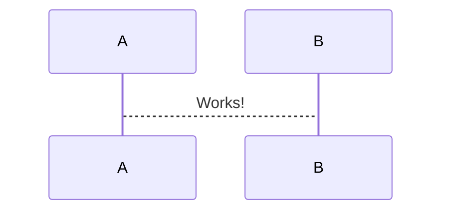

#VSCode

## Shortcuts
1. <kbd>alt + arriba/abajo</kbd>  mover líneas
2. <kbd>alt + shift + arriba/abajo</kbd> copia la línea 
3. <kbd>ctrl + shift + k</kbd> = borrar línea
4. <kbd>alt + click</kbd> múltiples cursores
5. <kbd>ctrl + alt + shift + arriba/abajo</kbd> múltiples cursores

https://code.visualstudio.com/docs/editor/codebasics


## Markdown

Esto es un simple párrafo con texto en **negritas**, _itálicas_ , y ~~tachado~~, <u>subrayado con html</u> 

<!-- esto es un comentario -->

Uso de listas:
- **item1**
- _item2_
- item3
    - dentro 1
    - dentro 2


* [x] tarea 2
* [ ] tarea 1

1. acción1
2. acción2

Referencia al [Primer header](#vscode)


## Instala las extensiones:
-  Markdown All in One
-  Markdown preview Enhanced
-  Markdown preview mermaid support


Se pueden usar símbolos matemáticos.
$$
  E_{i}^{x} = \frac{2}{x} * \sum_{i}{n}(23)
$$

Código embebido:
```python
#esto es python
def test():
    print("hola")
```
```javascript
// esto es javascript
let a = [1, 2, 3]
console.log(a);
```


Imagen oculta con html

 <details>
    
    <summary>Imagen de ciberseguridad<summary>
 </details>


Requiere de extensión markdown preview mermaid




Extensión TODO tree muestra un icono del lado izquerdo con un arbolito para ver donde se puso las etiquetas de TODO y FIXME. 

TODO: test

FIXME: TEST


