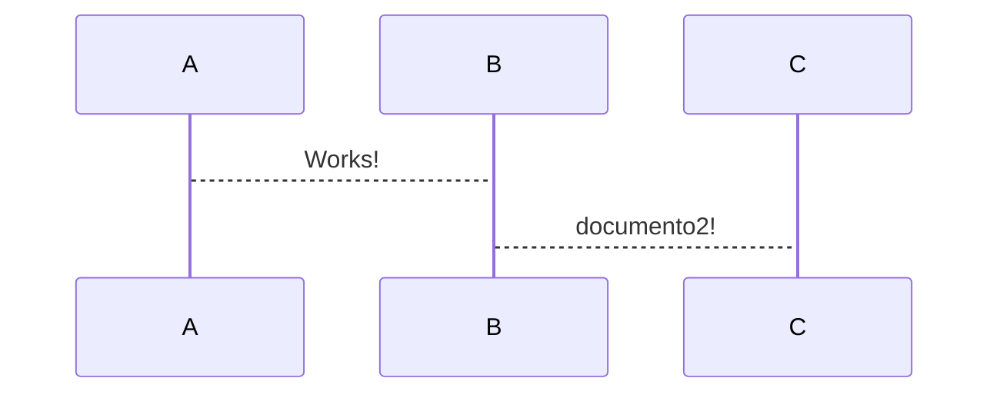

# VS Code and Markdown tricks

## Shorcuts básicos

* <kbd>alt + shift + up/down</kbd> copiar

* <kbd>alt + up/down</kbd> mover la linea

* <kbd>ctrl+shift + k</kbd> borrar. la linea

* <kbd>alt + click</kbd> crear cursores

* <kbd>ctrl+ alt + click</kbd> crear multiples cursores

## Markdown

1. item1
2. otro elemento
3. otro mas
    - sdfd
      - sdfd
        - sdf

- elemento
- otro
  
**negritas** _italicas_ y ~~tachado~~, subrayado con html <u>subrayado</u>

>nota especial

## tareas

* [x] tarea1
* [x] tarea2
* [x] tarea3

Enlaces internos al primer header [Primer header](#vs-code-and-markdown-tricks)

<!-- Ecuaciones en fomato LaTex -->
$$
  \alpha_{c}^{3}=\frac{3N^{2}}{\sum_{i}(n)}
$$

```python
# sdfsdf
def funcionPython():
    print("hola")
```

```javascript
    let c = 10
    console.log("hola", c)
```
<details>
    <summary>Details</summary>
    Something small enough to escape casual notice.
</details>




